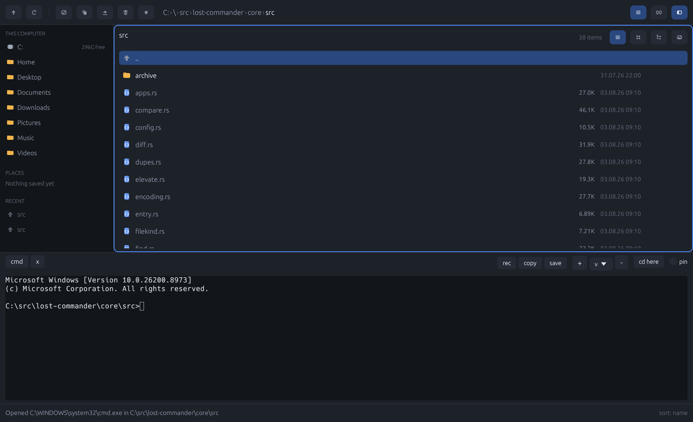

# lost-commander

A file manager in Rust, in the Norton Commander tradition, with two front-ends
over one engine. It runs unchanged on **Linux, macOS and Windows**.

It opens with **one pane**, which is XTree's arrangement rather than Norton's:
a tree and its files with the whole width to show them in. The second pane is
for the things that are actually about two places at once — a copy, a move, a
comparison, a preview — and every one of those brings it up by itself. `Tab`
asks for it, `F12` folds it away.

- **`lostc`** — a terminal UI. Function keys, no mouse required.
- **`lostc-gui`** — a graphical view laid out for a pointer rather than a
  teletype: a sidebar, a breadcrumb trail, per-pane list/grid/tree views, and
  a real shell in a drawer along the bottom.

Everything underneath — listing, sorting, marking, copy/move/delete with
progress and cancel, archives, bookmarks, network locations, the directory
tree, the account of what was done — lives in one library that neither front-
end owns.

## The terminal view

One panel, a status line, the command line, and the function keys. This is
generated from the real drawing code by a test, which fails if this picture
falls behind the program - a README's screenshot is otherwise a photograph of
whatever it looked like the day somebody typed it.

```
┌──────────────────────────────── ~/src/lost-commander/core ───────────────────────────────────────┐
│Name                                                                           Size Modified      │
│ ..                                                                            <UP>               │
│ archive                                                                      <DIR> 04.08.26 11:29│
│*entry.rs                                                                     5.52K 04.08.26 11:29│
│*fsops.rs                                                                     9.07K 04.08.26 11:29│
│ panel.rs                                                                     28.1K 04.08.26 11:29│
│ tree.rs                                                                      14.3K 04.08.26 11:29│
│                                                                                                  │
│                                                                                                  │
└──────────────────────────────────────────────────────────────────────────────────────────────────┘
F1 help   Tab opens a second panel   F10 or Ctrl-Q quits
~/src/lost-commander/core> cargo test█
F1Help   F2Rename F3View   F4Edit   F5Copy   F6Move   F7MkDir  F8Delete F9Sort   F10Quit
```

`Tab` opens a second panel beside this one, and `F12` puts it away again.

The third row from the bottom is the command line: what you type goes there
and Enter runs it in the directory being shown, exactly as in Norton
Commander. `Ctrl-O` puts the panels away and shows what the shell has
printed.

## The graphical view



## Installing

Nothing is packaged yet; this is the first release. From source:

```sh
cargo install lost-commander-tui     # lostc, the terminal one
cargo install lost-commander-egui    # lostc-gui, the graphical one
```

`packaging/` holds what a distribution package needs: man pages, completions
for bash, zsh and fish, a desktop entry, AppStream metainfo and an icon. A
package should install them as:

```
packaging/lostc.1                        -> /usr/share/man/man1/
packaging/lostc-gui.1                    -> /usr/share/man/man1/
packaging/completions/lostc.bash         -> /usr/share/bash-completion/completions/lostc
packaging/completions/_lostc             -> /usr/share/zsh/site-functions/
packaging/completions/lostc.fish         -> /usr/share/fish/vendor_completions.d/
packaging/lostc-gui.desktop              -> /usr/share/applications/
packaging/io.github.garalex.lost-commander.metainfo.xml -> /usr/share/metainfo/
packaging/io.github.garalex.lost-commander.svg          -> /usr/share/icons/hicolor/scalable/apps/
```

The desktop entry, the metainfo id and the icon filename all have to keep
agreeing, or a software centre shows an entry with no icon.

## Building

Needs a Rust toolchain (1.74 or newer). Nothing else on Windows or macOS; on
Linux the graphical front-end needs the usual X11 development packages that
any windowed Rust program does.

```sh
cargo build --release          # both binaries, into target/release/
```

The two front-ends are separate crates, so you can build one without paying
for the other. The terminal binary pulls in no windowing or GPU dependency at
all:

```sh
cargo build --release -p lost-commander-tui    # lostc alone
cargo build --release -p lost-commander-egui   # lostc-gui alone
```

## Running the terminal front-end

```sh
cargo run --bin lostc                      # the current directory
cargo run --bin lostc -- ~/src ~/documents # left, and the second when it opens
cargo run --bin lostc -- --list ~/src      # print a listing and exit
cargo run --bin lostc -- --help
```

```
Tab   other panel      Enter  open           Backspace  parent
F1    help             F2     rename         F3         view
F4    edit             F5     copy           F6         move
F7    mkdir            F8     delete         F9         sort
F10   quit             Space  mark           Ctrl-H     hidden files
F11   saved places     F12    second panel   Alt-T      tree
Ctrl-Q quit            Ctrl-C cancel or quit  Ctrl-Z    suspend
Ctrl-O shell screen    Escape back to the tree
```

`Tab` opens the second panel when only one is showing, so it is never a key
that does nothing. `F12` folds it away again, leaving whichever panel you were
reading — not the left one by default, which would move you somewhere else.

There is more than one way to quit on purpose, and the key bar shows both.

**If `F10` does nothing, your terminal is eating it.** GTK binds F10 to
"open the menubar" for every application, so GNOME Terminal, Terminator and
Tilix all take it by default — some setups bind it to close the window
instead. The keystroke is consumed by the emulator one layer above the
pseudo-terminal, so nothing is sent and no program running inside can see it.
Turn it off in GNOME Terminal under Preferences → General → *Enable the menu
accelerator key*, or just use `Ctrl-Q`, which nothing intercepts.

Worth knowing what happens next if you do press it: the menubar opens — it
does so even when hidden — and the terminal is then in menu navigation, where
plain letters are mnemonics rather than input. A `q` at that point is *File →
Quit*, which closes the whole terminal application and every tab in it. One
reader lost all their tabs that way, and the bar telling them "10 Quit" is
what suggested the `q`. `Ctrl-C` cancels a running copy, or clears the command line, or
quits when there is neither, which is what the keystroke means everywhere
else in a terminal. Letters go to the command line, so `q` does not quit.

`--list` is the whole listing pipeline with no terminal attached, which makes
it useful for a quick check that a build works, and for scripting.

## Running the graphical front-end

```sh
cargo run --bin lostc-gui                        # current directory
cargo run --bin lostc-gui -- ~/src ~/documents   # left, and the second when it opens
cargo run --bin lostc-gui -- --grid              # start both panes in the icon grid
cargo run --bin lostc-gui -- --tree              # tree above the files, XTree's arrangement
cargo run --bin lostc-gui -- --preview           # right pane follows the left, as F3 does
cargo run --bin lostc-gui -- --help
```

`Tab` opens the second pane and `F12` folds it away. `F3` borrows it for a
preview and gives it back when the preview closes; a folder comparison opens
it, since it has two directories to show. Each pane carries its own view
switch in its header — a dense detail list, a grid of large icons, the
directory tree, or a preview of whatever the *other* pane is pointing at. The
function keys do what they do in the terminal view.

There is one more argument, and it is how the view gets checked without a
human at the screen:

```sh
cargo run --bin lostc-gui -- --screenshot shot.png ~/src ~/documents
```

It renders a few frames, writes a PNG and exits. The picture above was made
with it.

**Where a copy goes.** `F5` and `F6` ask, in a field, with the other pane's
directory already in it when there is one — one Enter, as in every commander
since Norton. With a single pane there is nothing to guess at, so the field
offers the current directory instead: a starting point to edit rather than an
Enter to lean on. Nothing is ever copied into a directory that is not on
screen.

## What each front-end does

Both drive the same engine, so listing, sorting, marking, copy/move/delete
with progress and cancel, archives, folder compare and sync, the duplicate
finder, find-by-name-and-contents, permissions, tabs, bookmarks, network
locations, the directory tree, the trash and the journal work the same in
either.

The terminal one is not a cut-down version of the graphical one - it came
first, and it is the portable one. What it does not do is mostly what a
terminal cannot, plus one thing not yet built:

| | `lostc` | `lostc-gui` | why |
|---|---|---|---|
| File-type icons, grid of large icons | — | yes | there is no grid of icons in a terminal |
| Image viewing, and crop/rotate/resize | — | yes | same |
| Built-in text editor | — | yes | `lostc` hands the file to `$EDITOR`, which already knows your settings |
| Running commands | a command line, `Ctrl-O` for the output | a shell in a drawer, output in the window | `lostc` hands each command the real terminal; `lostc-gui` has no terminal to hand over, so it keeps one |
| A shell that stays put | yes | yes | one per session in the terminal view, one per tab in the drawer |
| The shell and the panel sharing a directory | yes, both ways | yes, both ways, and a tab can be pinned out of it | a `cd` either side moves the other; switching panes takes the shell along |
| Session recording (`rec`) | — | yes | it records that shell, so it needs one |
| Named colour schemes | one | several | the terminal view uses the classic blue/cyan palette, and a terminal has its own colours anyway |
| Markdown rendered rather than shown as markup | — | yes | not built for the terminal yet; the parse is in the engine, so it is drawing that is missing, not logic |

Reading bytes as hex, the directory tree, tabs and the journal are in both.

**On the shell.** `lostc` keeps one shell running underneath the panels for
the whole session, the way Midnight Commander does. Typing goes to the
command line and Enter hands the line to that shell; `Ctrl-O` swaps between
the panels and the shell's own screen, where you can work in it directly.

Because it is one shell rather than one per command, `cd` means something:
the directory it leaves you in is where the next command runs. It is shared
both ways — a `cd` in the shell moves the panel when you come back to it, and
moving the panel `cd`s the shell. The shell reports where it is through the
same `OSC 133` hook the graphical view uses, so this is reading an answer
rather than guessing at one.

A shell with no seam to hook — `cmd`, `dash` — cannot be asked, so the panel
becomes the answer instead: each command is preceded by a `cd` to the
directory the panel is showing, which is what Far Manager does on Windows and
for the same reason. Half-sharing a directory is worse than not sharing one.
`Ctrl-O` opens onto a line saying which of the two you have, and `Alt-O`
changes it.

## Testing

```sh
cargo test                     # all 1061, from the workspace root
```

From the root that is everything, because the root is a virtual manifest and
cargo defaults to every member of one. From *inside* a crate directory it is
that crate alone, which is a fast loop but easy to mistake for a full run —
say `cargo test --workspace` there if you meant all of it.

Per crate, when you want a fast loop:

```sh
cargo test -p lost-commander-core    # 637 - the engine, seconds to build
cargo test -p lost-commander-egui    # 196 - the graphical view
cargo test -p lost-commander-tui     # 122 - the terminal view
cargo test -p lost-commander-ffi     # 106 - the C ABI
```

The engine's tests are worth singling out: they cover the whole of the file
manager's behaviour with no user interface attached, and they build in a
fraction of the time the graphical crate does, because `core` depends on no
windowing library and the crate boundary is what guarantees it.

Some tests want real programs and skip rather than fail without them — zsh,
fish and dash for the shell-integration tests, the system's own `zip` and
`tar` for some archive fixtures. A machine with more of those installed runs
more tests.

### Driving the real thing

The tests do not substitute for running it, and most real bugs here were found
by running it. `harness/` holds two working harnesses with their own README:
`gui_archives.sh` drives the graphical binary under Xvfb with xdotool and
scrot, and `tui_journal.py` drives the terminal binary through a pty with
pyte.

## Layout

Four crates in one workspace. Each front-end depends on `core`; `core` depends
on none of them, and the compiler is what keeps it that way.

```
core/    the engine — filesystem and state, no drawing
tui/     lostc      — ratatui + crossterm
egui/    lostc-gui  — eframe/egui
ffi/     a C ABI, for front-ends that are not written in Rust
```

`ffi/` exists because a front-end need not be a Rust one. Values cross as
JSON, the caller polls and nothing calls back, no panic unwinds into C, and
every string and handle has one owner and one way back. A native Windows
front-end written in C# is built on it.

## Where things are kept

Settings, saved locations and the journal live in one directory per platform:

| | |
|---|---|
| Linux | `~/.config/lost-commander/` |
| macOS | `~/Library/Application Support/lost-commander/` |
| Windows | `%APPDATA%\lost-commander\` |

## License

Mozilla Public License 2.0 — see [LICENSE](LICENSE).

Copyleft, per file. Changes to *these* files must be published under the same
licence, so improvements to the engine come back rather than disappearing into
a fork. Linking this code from a larger work of your own is explicitly allowed
and puts no licence on that work (§3.3) — which is the reason for choosing MPL
over the GPL family, since this engine is designed to be driven through a C
ABI by front-ends it knows nothing about.

### Contribution

Unless you state otherwise, any contribution you intentionally submit for
inclusion in this work shall be licensed as above, without any additional
terms or conditions.
